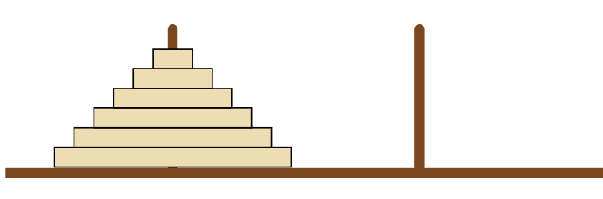

<div id="top"></div>

<div align="center">
	<a href="https://github.com/Link-Wolf/push_swap" title="Go to GitHub repo"></a>
	<a href="https://"></a>
	<a href="https://"></a>
	<a href="https://github.com/Link-Wolf/push_swap/stargazers"></a>
	<a href="https://github.com/Link-Wolf/push_swap/network/members"></a>
	<a href="https://github.com/Link-Wolf/push_swap/issues"></a>
	<a href="https://www.apple.com/macos/" title="Go to Apple homepage"></a>
</div>

<!-- PROJECT LOGO -->
<br />
<div align="center">
  <a>
    
  </a>

  <h3 align="center">Push_swap</h3>

  <p align="center">
	  <em>Because Swap_push isn’t as natural</em><br/>
    Optimized data sorting on stacks
    <br />
    <br />
    <a href="https://github.com/Link-Wolf/push_swap/issues">Report Bug</a>
    ·
    <a href="https://github.com/Link-Wolf/push_swap/issues">Request Feature</a>
  </p>
</div>

<!-- TABLE OF CONTENTS -->
<details>
  <summary>Table of Contents</summary>
  <ol>
    <li>
      <a href="#about-the-project">About The Project</a>
    </li>
    <li>
      <a href="#getting-started">Getting Started</a>
      <ul>
        <li><a href="#prerequisites">Prerequisites</a></li>
        <li><a href="#installation">Installation</a></li>
      </ul>
    </li>
    <li><a href="#usage">Usage</a></li>
    <li><a href="#roadmap">Roadmap</a></li>
    <li><a href="#contributing">Contributing</a></li>
  </ol>
</details>

<!-- ABOUT THE PROJECT -->

## About The Project

<div>
<p>
  <a>
    
  </a>
  </p>
</div>

This project is a very simple and highly effective algorithm project: data will
need to be sorted. </br>
We have at our disposal, 2 stacks (`a` and `b`), a set of int values without duplicates that will be initialized in the stack `a`, and a set of instructions to manipulate both stacks :

-   `ra` / `rb` rotates either `a` or `b`
-   `rra` / `rrb` rotates either `a` or `b` but in the other direction
-   `rr` / `rrr` rotates both `a` and `b` in one direction or the other
-   `pa` pushes the top element of `b` to `a`
-   `pb` pushes the top element of `a` to `b`
-   `sa` / `sb` switches the two top elements of `a` / `b`
-   `ss` switches the two top elements of both `a` and `b`

The program should then print in the terminal all the instructions to sort the int values into the stack `a`, by using the stack `b`

The evaluation is made according to the performance of the program (how many operations the program print to sort the stack `a`)

### Bonus features

Make a "Checker" which will get as an argument the stack `a` formatted as a list of integers (in the same way as the push_swap program)

The program will then wait and read instructions on the standard input.
Once all the instructions have been read, the checker will execute them on the stack received as an argument and print `OK` only if the stack `a` is correctly sorted, `KO` otherwise.

We can call the push_swap program then pipe `|` the checker with the same arguments to verify if our push_swap works as intended

<p align="right">(<a href="#top">back to top</a>)</p>

<!-- GETTING STARTED -->

## Getting Started

Because it's a simple C program, there isn't much to say here

### Prerequisites

Having a C compiler like cc, gcc or clang

### Installation

1. Clone the repo
    ```sh
    git clone https://github.com/Link-Wolf/push_swap.git
    ```
2. Compile push_swap
    ```sh
    cd push_swap; make
    ```
3. Execute the program with a list of integers as a parameter / multiples parameters
    ```sh
    ./push_swap "5 648 1 36 -1 98 -364 0"
    ```
    or
    ```sh
    ./push_swap 5 648 1 36 -1 98 -364 0
    ```

<p align="right">(<a href="#top">back to top</a>)</p>

<!-- USAGE EXAMPLES -->

## Usage

Test this push_swap with the integers you want, and with as many you want !

#### Push swap program

```sh
   ./push_swap "5 1 -1 -3 0"
```

#### Possible output

```
	pb
	pb
	sa
	pa
	ra
	pa
	ra
```

#### Checker program

```sh
   ./push_swap "5 1 -1 -3 0" | ./checker "5 1 -1 -3 0"
```

#### Output

```
	OK
```

_The checker will print `Error` if one of the given instructions does not exist_

<p align="right">(<a href="#top">back to top</a>)</p>

<!-- ROADMAP -->

## Roadmap

-   [x] Add the checker
-   [x] Add back to top links

See the [open issues](https://github.com/Link-Wolf/push_swap/issues) for a full list of proposed features (and known issues).

<p align="right">(<a href="#top">back to top</a>)</p>

<!-- CONTRIBUTING -->

## Contributing

If you have a suggestion that would make this better, please fork the repo and create a pull request. You can also simply open an issue with the tag "enhancement".
Don't forget to give the project a star! Thanks again!

1. Fork the Project
2. Create your Feature Branch (`git checkout -b feature/AmazingFeature`)
3. Commit your Changes (`git commit -m 'Add some AmazingFeature'`)
4. Push to the Branch (`git push origin feature/AmazingFeature`)
5. Open a Pull Request

<p align="right">(<a href="#top">back to top</a>)</p>
